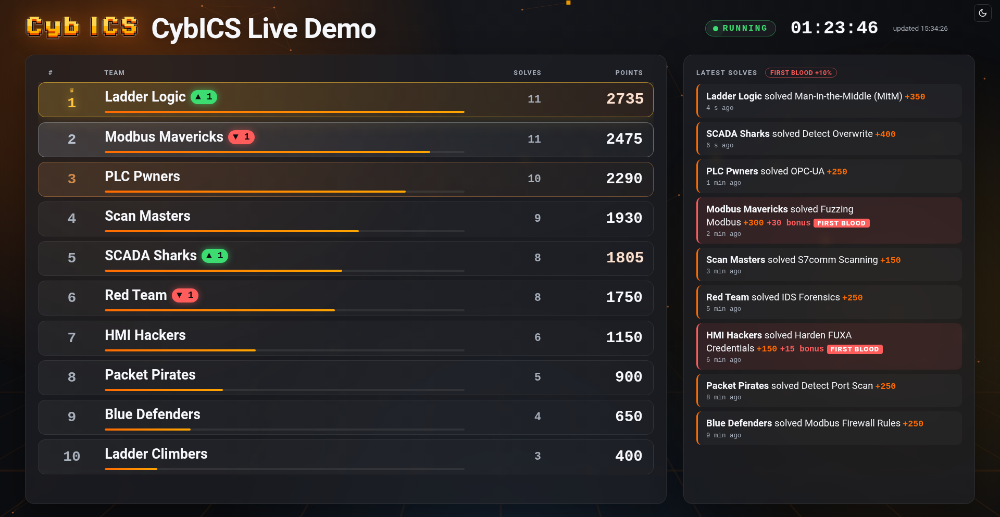

<p align="center">
  
  <p align="center"><strong>CTF</strong> &middot; The central scoreboard and event server for CybICS.</p>
</p>

---

<div align="center">

[](/LICENSE)
[](https://github.com/mniedermaier/CybICS-CTF/actions/workflows/pytest.yml)
[](https://github.com/mniedermaier/CybICS-CTF/actions/workflows/client.yml)
[](https://github.com/mniedermaier/CybICS-CTF/actions/workflows/compose.yml)
[](https://github.com/mniedermaier/CybICS-CTF/actions/workflows/codeql.yml)
[](https://github.com/mniedermaier/CybICS-CTF/actions/workflows/trufflehog.yaml)
[](https://buymeacoffee.com/mniedermaier)
</div>

---

## What is CybICS-CTF?

[CybICS](https://github.com/mniedermaier/CybICS) is an open-source training platform for industrial
control system security. It runs virtually in Docker or on a Raspberry Pi with a custom PCB, and it
ships with 22 capture-the-flag challenges.

CybICS-CTF turns many CybICS instances into **one event**. Participants enrol their CybICS from its
landing page, virtual or physical alike, and every solved challenge appears on a shared, animated
scoreboard. The organiser gets one place to run the workshop: teams, instances, moderation and
announcements.

**It is optional.** CybICS validates flags and keeps progress locally, exactly as before. An instance
that is never enrolled makes no network calls. An enrolled instance keeps working if the server goes
away, and reports what it missed when the server comes back.

### Why CybICS-CTF?

- ✅ **Projector-ready scoreboard**: ranks glide when teams overtake each other, scores count up, and
  first bloods take over the screen. It fills exactly one screen, never shows a scrollbar, and scrolls
  long team lists by whole rows.
- ✅ **Virtual and physical**: Docker instances and Raspberry Pi boards (via a USB Wi-Fi dongle) join
  the same event; boards are recognised by their STM32 UID.
- ✅ **Built for a classroom**: one NAT address for everybody, a participant trying to disrupt the
  event, a flaky Wi-Fi. None of these lock out honest teams or lose solves.
- ✅ **Moderation with evidence**: void a solve, revoke an instance, disqualify a team. Nothing is
  deleted, and every organiser action is logged.
- ✅ **Optional first blood bonus**: a percentage of a challenge's points for the first team to solve it.
- ✅ **Hardened by default**: two read-only containers without capabilities, a buffering nginx in
  front, a strict Content Security Policy, CSRF protection everywhere.

---

## Table of Contents

- [What is CybICS-CTF?](#what-is-cybics-ctf)
- [Screenshots](#screenshots)
- [Status](#status)
- [Quick Start](#-quick-start)
- [Running an Event](#-running-an-event)
- [Configuration](#%EF%B8%8F-configuration)
- [How It Works](#-how-it-works)
- [Documentation](#documentation)
- [Contributing](#contributing)
- [License](#license)

---

## Screenshots

<table>
<tr>
<td width="62%" valign="top">

### 📺 Scoreboard for the projector
**Live ranking, rank changes, first blood bonus**



</td>
<td width="38%" valign="top">

### 🛠️ Organiser view
**Join code, event state, teams, announcements**


</td>
</tr>
</table>

Both follow the CybICS look, in a dark and a light theme. Add `?theme=dark` or `?theme=light` to the
scoreboard URL to pin one on a projector.

---

## Status

| Part | State |
|---|---|
| Server: API, admin UI, scoreboard, moderation, audit | ✅ Ready |
| Reference client (`client/cybics_ctf_client.py`) | ✅ Ready, tested on Python 3.9 and 3.12 |
| CybICS landing page: **Settings → Central CTF server** | 🚧 Not yet in CybICS. The changes are specified in [docs/CYBICS_INTEGRATION.md](docs/CYBICS_INTEGRATION.md) |
| CybICS Raspberry Pi: second Wi-Fi interface for the uplink | 🚧 Specified in [docs/CYBICS_INTEGRATION.md](docs/CYBICS_INTEGRATION.md#2-physical-device-second-wi-fi-interface) |

Until the CybICS side lands, instances can be enrolled with the reference client directly.

---

## 🚀 Quick Start

### Prerequisites

- Docker with Docker Compose
- The `ctf_config.json` of the CybICS version your participants run
  (`software/landing/ctf_config.json` in the [CybICS](https://github.com/mniedermaier/CybICS) repository)

### Installation

```bash
git clone https://github.com/mniedermaier/CybICS-CTF.git
cd CybICS-CTF
cp .env.example .env        # optional: adjust settings
docker compose up -d --build
```

Open **`http://<host>:8000/admin`** and log in. Without `CTF_ADMIN_PASSWORD`, a password is generated
on first start; read it with `docker compose exec ctf-server cat /data/admin_password`.

### Your first event

1. **Create an event** on the *Events* page and note its **join code**.
2. **Import the challenges**: on the event's *Challenges* page, upload CybICS'
   `software/landing/ctf_config.json`. Only a hash of each flag is stored.
3. **Optional**: set a **first blood bonus** in the event settings, for example 10 %.
4. **Let teams join**: participants enter the server address, the join code, a team name and a team
   password in their CybICS. A new team needs a password of at least 8 characters that is not a
   well-known one. Teammates enter the same team name and password on their own CybICS.
5. **Press Start.** Solves only count while the event is running. *Pause*, *Resume* and *Finish*
   follow, and a finished event can be reopened.
6. **Put the scoreboard on the projector**: `http://<host>:8000/scoreboard/<slug>`, in full screen.

The same from the command line:

```bash
docker compose exec ctf-server flask --app cybics_ctf create-event workshop "CybICS Workshop"
docker compose exec -T ctf-server flask --app cybics_ctf import-catalog workshop - \
    < ../CybICS/software/landing/ctf_config.json
docker compose exec ctf-server flask --app cybics_ctf set-state workshop running
```

The containers' root filesystems are read-only, so the catalog is piped in on stdin (`-`).

---

## 🎯 Running an Event

### During the event

- **Instances** shows every enrolled CybICS with its team, kind (virtual or physical), version,
  service health and last check-in. Revoked instances are hidden unless you ask for them.
- **Solves & audit** lists every solve, with filters and CSV exports. *Suspicious activity* shows
  wrong flags and wrong team passwords. An unmodified CybICS never sends a wrong flag, so one there
  means somebody is calling the API directly.
- **Moderation**: **void** a solve (it stops scoring but stays on record), **revoke** an instance,
  **disqualify** a team. Several teams can be handled at once on the *Teams* page.
- **Announcements** reach every enrolled landing page within one heartbeat (30 s).
- **Log** keeps every organiser action, from the web UI and the command line.

### Locked out?

Failed admin logins are limited per address. If a participant on the same network keeps the login
locked, get a one-time login link from the server's shell. It is valid for 10 minutes and works once:

```bash
docker compose exec ctf-server flask --app cybics_ctf login-link
```

Once logged in, the *Events* page lists every address that currently hits a limit, and one click
clears them all.

### Backups

```bash
docker compose exec ctf-server flask --app cybics_ctf backup /data/backup-$(date +%F-%H%M).sqlite
docker compose cp ctf-server:/data/backup-<timestamp>.sqlite .
```

`backup` uses SQLite's `VACUUM INTO` and is safe while the server runs. Do not copy the database file
directly; it runs in WAL mode. For rolling backups during an event, give `backup` a directory and a
number of files to keep, from a cron entry on the host:

```
*/15 * * * * cd /path/to/CybICS-CTF && docker compose exec -T ctf-server sh -c 'mkdir -p /data/backups && flask --app cybics_ctf backup /data/backups --keep 96'
```

Copy the backups off the host now and then: they live on the same volume as the database.

### Exposing the server

On an isolated event Wi-Fi, plain HTTP through the bundled proxy is fine. Anywhere else, put a TLS
proxy in front, for example Caddy on the same host:

```
ctf.example.org {
    reverse_proxy 127.0.0.1:8000
}
```

and start the stack with `CTF_BIND=127.0.0.1 CTF_OUTER_PROXY=172.29.84.1 CTF_SECURE_COOKIES=1`.
`172.29.84.1` is the gateway of the stack's network, where nginx sees a proxy on the host come from.

> [!IMPORTANT]
> Docker publishes ports past host firewalls such as `ufw`. A port bound to `0.0.0.0` is reachable from
> the network even if `ufw` does not allow it. Use `CTF_BIND=127.0.0.1` when only this machine, or a
> proxy on it, should reach the server.

The bundled nginx has no per-address connection cap on purpose: a classroom, the projector and the
organiser often share one NAT address, and such a cap would let one participant cut off everybody
behind it. On a server reachable from the internet, add a generous cap in the host firewall:

```bash
iptables -I DOCKER-USER -p tcp --dport 8000 --syn -m connlimit --connlimit-above 5000 -j REJECT
```

---

## ⚙️ Configuration

Every setting can be passed in the shell or in a `.env` file next to `docker-compose.yml`. Start from
the commented example; `.env` itself is gitignored:

```bash
cp .env.example .env
```

| Variable | Default | |
|---|---|---|
| `CTF_ADMIN_PASSWORD` | generated | At least 8 characters. If unset, generated on first start and kept in `/data/admin_password`. |
| `CTF_ALLOW_WEAK_ADMIN_PASSWORD` | `0` | `1` accepts a shorter admin password, for a local test setup only. Logged as a warning at every start. |
| `CTF_SECRET_KEY` | generated | Session key, at least 16 characters. If unset, generated and kept in `/data/secret_key`. |
| `CTF_SERVER_NAME` | `CybICS CTF` | Shown in the UI and returned by `/api/v1/info`. |
| `CTF_PUBLIC_URL` | none | Where organisers reach the server, e.g. `https://ctf.example.org`; used in the links `login-link` prints. |
| `CTF_HEARTBEAT_INTERVAL` | `30` | Seconds between instance check-ins; the server tells the clients. |
| `CTF_ONLINE_WINDOW` | `90` | An instance counts as online if it checked in within this many seconds. |
| `CTF_RATE_ENROLL` | `60` | Wrong team passwords per address per minute before enrolment from it pauses. `0` switches the guard off. |
| `CTF_RATE_NEW_TEAMS` | `100` | New teams one address may create per 10 minutes. Only teams actually created count. |
| `CTF_RATE_HEARTBEAT` / `CTF_RATE_SOLVE` | `30` | Requests per instance per minute. |
| `CTF_RATE_LOGIN` | `10` | Failed admin logins per address per 5 minutes. |
| `CTF_ADMIN_SESSION_HOURS` | `12` | Admin sessions end after this many hours, on log out, or when the admin password changes. |
| `CTF_BIND` / `CTF_PORT` | `0.0.0.0` / `8000` | Where the stack's port is published. |
| `CTF_OUTER_PROXY` | none | Address or CIDR of an outer TLS proxy, as nginx sees it. Client address and `https` are then taken from it, and from nobody else. |
| `CTF_SECURE_COOKIES` | `0` | `1` when the server is served over HTTPS. |
| `CTF_SUBNET`, `CTF_PROXY_IP`, `CTF_APP_IP` | `172.29.84.0/24`, `.2`, `.3` | The stack's internal network; change it if it collides with a local one. |
| `CTF_LOG_LEVEL` | `INFO` | Log level of the server's own log lines. |

Outside Docker Compose, `CTF_TRUST_PROXY=1`, `CTF_FORWARDED_ALLOW_IPS` (the proxy's addresses) and
`CTF_PROXY_HOPS` (number of trusted proxies) configure the forwarded headers, and `CTF_DATA_DIR`
(default `./data`) holds the database and the generated secrets.

---

## 🧩 How It Works

```
 participants                                                         organiser
┌────────────────────────┐   POST /api/v1/enroll     (once)        ┌──────────────────────┐
│ CybICS (Docker)        │   POST /api/v1/heartbeat  (every 30 s)  │  proxy (nginx)       │
│  landing ─ client ─────┼──────────────────────────────────────►  │   └─ ctf-server      │
└────────────────────────┘   POST /api/v1/solves     (each solve)  │      Flask + SQLite  │
┌────────────────────────┐                                         │                      │
│ CybICS (Pi + PCB)      │                                         │  /admin              │
│  landing ─ client ─────┼── wlan1 (USB dongle) ─────────────────► │  /scoreboard/<slug>  │
└────────────────────────┘                                         └──────────────────────┘
```

- **Enrol once, then report.** An instance enrols with the join code, a team name and password, and
  gets a token. From then on it sends a heartbeat every 30 s (status, version, service health) and
  reports each solve its landing page has already validated locally.
- **Nothing gets lost.** Reports wait in a persistent outbox while the server is unreachable. Every
  heartbeat compares the local solves with the server's record and resends what is missing.
- **Fair scoring.** Solves count only while the event is running, are ordered by the server's clock,
  and ties go to the team that reached the score first.
- **Honest about cheating.** CybICS flags are the same in every installation and printed in the
  training material, so no server can *prove* a solve. CybICS-CTF makes honest play the easy path and
  dishonest play visible: enrolled instances only, an audit of every submission, wrong flags flagged,
  and moderation that keeps the evidence.

The full design, the sync protocol and the trust model are in [docs/ARCHITECTURE.md](docs/ARCHITECTURE.md).

---

## Documentation

| Document | |
|---|---|
| [docs/ARCHITECTURE.md](docs/ARCHITECTURE.md) | What the investigation of CybICS found, the design, the sync protocol, the trust model, shared-address handling |
| [docs/API.md](docs/API.md) | The instance API (`/api/v1`): enrolment, heartbeat, solves, scoreboard |
| [docs/CYBICS_INTEGRATION.md](docs/CYBICS_INTEGRATION.md) | The changes needed in CybICS: landing settings page, the Pi's second Wi-Fi interface, network isolation |
| [CLAUDE.md](CLAUDE.md) | Conventions and invariants for contributors and AI assistants |

### Repository layout

| Path | |
|---|---|
| `server/` | The Flask application (`cybics_ctf/`), its Dockerfile and the test suite |
| `client/cybics_ctf_client.py` | Reference client for CybICS' landing page: one file, standard library only |
| `proxy/` | nginx in front of the app: request buffering, short timeouts, enrolment queue, real client address |
| `tools/slowloris_check.py` | Checks that one abusive client cannot freeze the server (slow uploads, idle connections, enrolment flood) |
| `docs/` | Architecture, API, CybICS integration, pictures |

---

## Contributing

Contributions are welcome. Please open an issue first for larger changes.

### Development Setup

```bash
cd server
pip install -r requirements-dev.txt
ruff check ..
pytest --cov=cybics_ctf --cov=cybics_ctf_client
flask --app cybics_ctf run --debug      # data goes to ./data
```

The suite covers the API, the admin UI, the CLI, the migrations and the reference client against a
live server: outages, reconciliation, pauses, late catalogs, revocation and stale answers. CI also runs
the client on Python 3.9 and checks the hardened Docker stack against
`tools/slowloris_check.py`.

1. Fork the repository and create a branch: `git checkout -b feature/your-feature-name`
2. Commit using [Conventional Commits](https://www.conventionalcommits.org/): `git commit -m "feat(server): describe the change"`
3. Push and open a Pull Request describing the cause, the fix and what you verified

Everything in git and on GitHub is written in English. The full set of conventions and invariants is
in [CLAUDE.md](CLAUDE.md). It is written for AI assistants but applies to everyone.

---

## License

CybICS-CTF is released under the **MIT License**. See [LICENSE](/LICENSE) for details.

### Third-Party Components

- **Inter** typeface: SIL Open Font License 1.1 (`server/cybics_ctf/static/fonts/Inter-LICENSE.txt`)
- **CybICS logo**: from the [CybICS](https://github.com/mniedermaier/CybICS) project, MIT License

---

<p align="center">
  <strong>Ready to run an event?</strong><br>
  <code>docker compose up -d --build</code>
</p>

<p align="center">
  <a href="https://github.com/mniedermaier/CybICS">🏭 CybICS</a> •
  <a href="docs/ARCHITECTURE.md">📘 Architecture</a> •
  <a href="docs/API.md">🔌 API</a> •
  <a href="https://github.com/mniedermaier/CybICS-CTF/issues">🐛 Report Issues</a>
</p>
