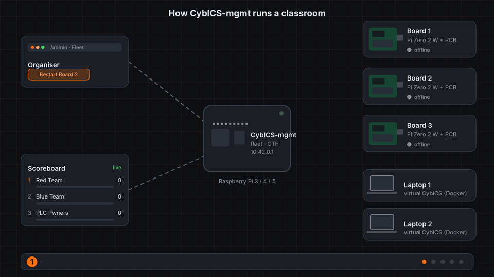
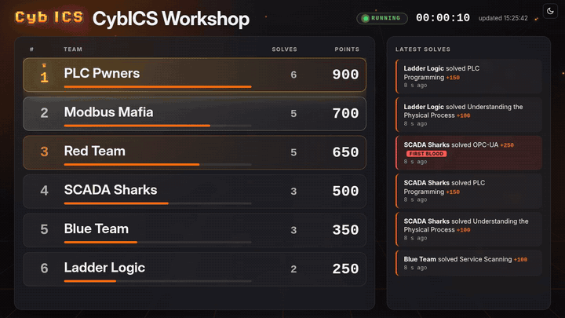
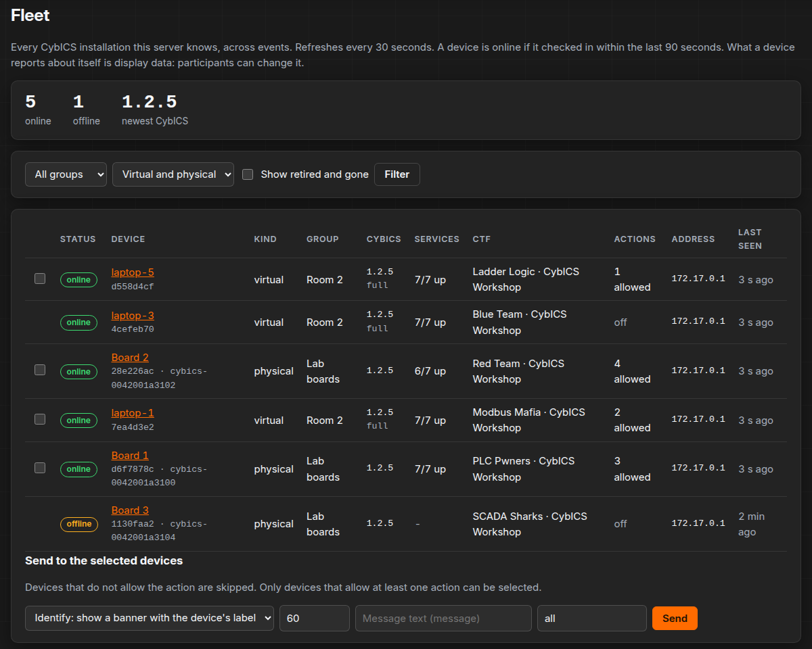
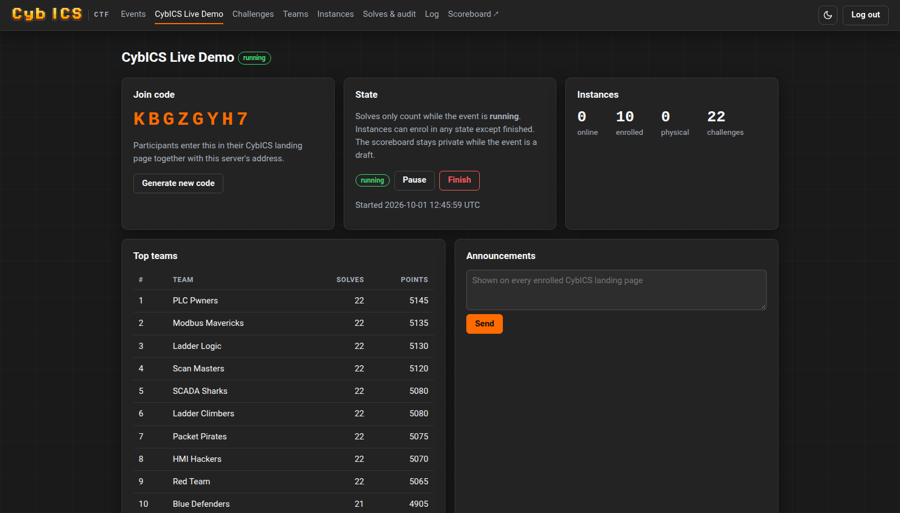

<p align="center">
  
  <p align="center"><strong>mgmt</strong> &middot; The central server for CybICS: CTF events and fleet management.</p>
</p>

---

<div align="center">

[](/LICENSE)
[](https://github.com/mniedermaier/CybICS-mgmt/actions/workflows/pytest.yml)
[](https://github.com/mniedermaier/CybICS-mgmt/actions/workflows/client.yml)
[](https://github.com/mniedermaier/CybICS-mgmt/actions/workflows/compose.yml)
[](https://github.com/mniedermaier/CybICS-mgmt/actions/workflows/codeql.yml)
[](https://github.com/mniedermaier/CybICS-mgmt/actions/workflows/trufflehog.yaml)
[](https://github.com/mniedermaier/CybICS-mgmt/actions/workflows/rpi-image.yml)
[](https://buymeacoffee.com/mniedermaier)
</div>

<p align="center">
  
</p>

---

## What is CybICS-mgmt?

[CybICS](https://github.com/mniedermaier/CybICS) is an open-source training platform for industrial
control system security. It runs virtually in Docker or on a Raspberry Pi with a custom PCB, and it
ships with 22 capture-the-flag challenges.

CybICS-mgmt is the central server for many CybICS installations. Each installation connects once
from its landing page, virtual or physical alike, and becomes a **device** on the server. The server
has two parts:

- **CTF events**: devices join teams, and many CybICS installations become **one event**. Every
  solved challenge appears on a shared, animated scoreboard. The organiser gets one place to run the
  workshop: teams, devices, moderation and announcements.
- **Fleet management**: every device in one overview, across events, with telemetry and, where the
  device allows it, remote actions such as restarting services. The design is in
  [docs/MGMT_DESIGN.md](docs/MGMT_DESIGN.md).

CybICS-mgmt (called CybICS-CTF until October 2026) ships together with the CybICS release that
replaces v1.2.4; that release has the client built in.

**It is optional.** CybICS validates flags and keeps progress locally, exactly as before. An
installation that is never connected makes no network calls. A connected one keeps working if the
server goes away, and reports what it missed when the server comes back.

### Why CybICS-mgmt?

- ✅ **Projector-ready scoreboard**: ranks glide when teams overtake each other, scores count up, and
  first bloods take over the screen. It fills exactly one screen, never shows a scrollbar, and scrolls
  long team lists by whole rows.
- ✅ **Virtual and physical**: Docker instances and Raspberry Pi boards (via a USB Wi-Fi dongle) join
  the same event; boards are recognised by their STM32 UID.
- ✅ **Built for a classroom**: one NAT address for everybody, a participant trying to disrupt the
  event, a flaky Wi-Fi. None of these lock out honest teams or lose solves.
- ✅ **Moderation with evidence**: void a solve, take a device out of the event, disqualify a team.
  Nothing is deleted, and every organiser action is logged.
- ✅ **Optional first blood bonus**: a percentage of a challenge's points for the first team to solve it.
- ✅ **Hardened by default**: two read-only containers without capabilities, a buffering nginx in
  front, a strict Content Security Policy, CSRF protection everywhere.

---

## Table of Contents

- [What is CybICS-mgmt?](#what-is-cybics-mgmt)
- [Screenshots](#screenshots)
- [Status](#status)
- [Quick Start](#-quick-start)
- [Raspberry Pi Image](#-raspberry-pi-image)
- [Running an Event](#-running-an-event)
- [Configuration](#%EF%B8%8F-configuration)
- [How It Works](#-how-it-works)
- [Documentation](#documentation)
- [Contributing](#contributing)
- [License](#license)

---

## Screenshots

### 📺 Scoreboard for the projector
**Recorded live: a team climbs, a first blood takes over the screen, ranks move with ▲ and ▼**



<table>
<tr>
<td width="55%" valign="top">

### 🛰️ Fleet
**Every CybICS installation across events: online state, version, services, team, allowed actions**



</td>
<td width="45%" valign="top">

### 🛠️ Organiser view
**Join code, event state, teams, announcements**



</td>
</tr>
</table>

Everything follows the CybICS look, in a dark and a light theme. Add `?theme=dark` or
`?theme=light` to the scoreboard URL to pin one on a projector. The animated diagram at the top is
drawn by `tools/readme_animation.py`; the scoreboard was recorded from a real server.

---

## Status

| Part | State |
|---|---|
| CTF: API, admin UI, scoreboard, moderation, audit | ✅ Ready |
| Reference client (`client/cybics_mgmt_client.py`) | ✅ Ready, tested on Python 3.9 and 3.12 |
| Fleet: device overview across events, groups, enrolment codes, putting devices into teams | ✅ Ready |
| Fleet: remote actions on devices that allow them | ✅ Server and client ready |
| CybICS landing page: **Settings → CybICS-mgmt** | 🚧 In review: [CybICS#263](https://github.com/mniedermaier/CybICS/pull/263), for the release that replaces v1.2.4 |
| CybICS Raspberry Pi: second Wi-Fi interface for the uplink | ✅ In CybICS v1.2.4 (USB Wi-Fi dongle) |
| Raspberry Pi image of CybICS-mgmt with the `cybics-mgmt` access point | ✅ Built by CI, attached to every release |
| CybICS boards joining `cybics-mgmt` on their own | 🚧 In review: [CybICS#263](https://github.com/mniedermaier/CybICS/pull/263) (with the landing integration) |

---

## 🚀 Quick Start

### Prerequisites

- Docker with Docker Compose
- The `ctf_config.json` of the CybICS version your participants run
  (`software/landing/ctf_config.json` in the [CybICS](https://github.com/mniedermaier/CybICS) repository)

### Installation

```bash
git clone https://github.com/mniedermaier/CybICS-mgmt.git
cd CybICS-mgmt
cp .env.example .env        # optional: adjust settings
docker compose up -d --build
```

Open **`http://<host>:8000/admin`** and log in. Without `MGMT_ADMIN_PASSWORD`, a password is generated
on first start; read it with `docker compose exec server cat /data/admin_password`.

### Your first event

1. **Create an event** on the *Events* page and note its **join code**.
2. **Import the challenges**: on the event's *Challenges* page, upload CybICS'
   `software/landing/ctf_config.json`. Only a hash of each flag is stored.
3. **Optional**: set a **first blood bonus** in the event settings, for example 10 %.
4. **Let teams join**: in *Settings → CybICS-mgmt* of their CybICS, participants connect with the
   server address and the join code, then join a team with the join code, a team name and a team
   password. A new team needs a password of at least 8 characters that is not a well-known one.
   Teammates enter the same team name and password on their own CybICS. You can also put a device
   into a team yourself, from its page in the *Fleet*.
5. **Press Start.** Solves only count while the event is running. *Pause*, *Resume* and *Finish*
   follow, and a finished event can be reopened.
6. **Put the scoreboard on the projector**: `http://<host>:8000/scoreboard/<slug>`, in full screen.

The same from the command line:

```bash
docker compose exec server flask --app cybics_mgmt create-event workshop "CybICS Workshop"
docker compose exec -T server flask --app cybics_mgmt import-catalog workshop - \
    < ../CybICS/software/landing/ctf_config.json
docker compose exec server flask --app cybics_mgmt set-state workshop running
```

The containers' root filesystems are read-only, so the catalog is piped in on stdin (`-`).

---

## 📦 Raspberry Pi Image

For a classroom without any infrastructure, CybICS-mgmt runs on a Raspberry Pi 3, 4, 5 or Zero 2 W
that also hosts the Wi-Fi network. Every release has the SD card image attached
(`*-CybICS-mgmt.img.xz`).

| | Default |
|---|---|
| Wi-Fi network | `cybics-mgmt`, password `cybics-mgmt`, 2.4 GHz, channel 6 |
| Web interface | `http://10.42.0.1` or `http://cybics-mgmt.local` |
| Admin password | generated at the first start and shown on the console (HDMI) |
| Enrolment code for CybICS boards | `CYBICS-BOARDS` |
| SSH | `pi` / `raspberry` |

1. Write the image to an SD card (`xzcat *-CybICS-mgmt.img.xz | sudo dd of=/dev/sdX bs=4M
   conv=fsync status=progress`, or Raspberry Pi Imager under "Use custom").
2. Before the first boot, open the card's boot partition on any computer and edit `cybics-mgmt.txt`:
   Wi-Fi name, **password** and **country**, the admin password, the boards' enrolment code. It is
   read at every boot, and the console lists any value it could not use.
3. Boot the Pi. The first boot loads the containers and takes a few minutes.
4. Join the Wi-Fi with a laptop and open `http://10.42.0.1/admin`.

**The default network.** CybICS boards with a USB Wi-Fi dongle look for `cybics-mgmt`. As soon as it
is in range they connect and enrol with the code `CYBICS-BOARDS`, and show up in the fleet. If you
change the network's name or password, or the code, change them on the boards too. Disable the code
under *Fleet → Groups & codes* to stop boards from enrolling on their own. (The board side is part of
the CybICS release that replaces v1.2.4.)

The defaults are public, like the CybICS boards' own. Change the Wi-Fi password and the `pi`
password before the Pi goes on any network you care about. The access point also forwards to the
Pi's Ethernet port if it is connected.

Build the image yourself with `image/build.sh` (Docker with buildx; on an x86 host also qemu for
arm64). The release workflow builds it natively on an arm64 runner.

---

## 🎯 Running an Event

### During the event

- **Instances** shows every device in the event with its team, kind (virtual or physical), version,
  service health and last check-in. Devices that left are hidden unless you ask for them.
- **Solves & audit** lists every solve, with filters and CSV exports. *Suspicious activity* shows
  wrong flags and wrong team passwords. An unmodified CybICS never sends a wrong flag, so one there
  means somebody is calling the API directly.
- **Moderation**: **void** a solve (it stops scoring but stays on record), **revoke** a device's
  membership (it leaves the event), **disqualify** a team. Several teams can be handled at once on
  the *Teams* page.
- **Announcements** reach every landing page in the event within one heartbeat (30 s).
- **Log** keeps every organiser action, from the web UI and the command line.

### The fleet

*Fleet* lists every CybICS installation the server knows, across events: online state, version (with
an *outdated* marker against the newest in the fleet), service health, group and CTF team.

- Every installation that connects shows up here, whether it takes part in an event or not.
- **Groups** (a room, a set of boards) and **enrolment codes** are on *Fleet → Groups & codes*. A
  device that connects with a code lands in its group; an event's join code works too.
- **Put a device into a team** from its page, without the team password, or take it out of its
  event. The device follows within one heartbeat.
- Give boards a **label** that matches the sticker on them, and **retire** devices you no longer use.
  Retiring ends the device's event membership. Nothing is deleted.
- Two devices reporting the same board UID are flagged, never merged: the UID is broadcast in the
  board's SSID and can be copied.
- **Remote actions** on devices that allow them: identify (a banner with the label), a message,
  restart services, reset the local CTF progress, collect logs. Send them from a device's page, or
  to several devices at once from the list. Each device decides which actions it allows, all off by
  default, and runs only jobs signed with the key it pinned when it enrolled. Every job, its result
  and every organiser action are on the *Fleet log*.

### Locked out?

Failed admin logins are limited per address. If a participant on the same network keeps the login
locked, get a one-time login link from the server's shell. It is valid for 10 minutes and works once:

```bash
docker compose exec server flask --app cybics_mgmt login-link
```

Once logged in, the *Events* page lists every address that currently hits a limit, and one click
clears them all.

### Backups

```bash
docker compose exec server flask --app cybics_mgmt backup /data/backup-$(date +%F-%H%M).sqlite
docker compose cp server:/data/backup-<timestamp>.sqlite .
```

`backup` uses SQLite's `VACUUM INTO` and is safe while the server runs. Do not copy the database file
directly; it runs in WAL mode. For rolling backups during an event, give `backup` a directory and a
number of files to keep, from a cron entry on the host:

```
*/15 * * * * cd /path/to/CybICS-mgmt && docker compose exec -T server sh -c 'mkdir -p /data/backups && flask --app cybics_mgmt backup /data/backups --keep 96'
```

Copy the backups off the host now and then: they live on the same volume as the database.

### Exposing the server

On an isolated event Wi-Fi, plain HTTP through the bundled proxy is fine. Anywhere else, put a TLS
proxy in front, for example Caddy on the same host:

```
mgmt.example.org {
    reverse_proxy 127.0.0.1:8000
}
```

and start the stack with `MGMT_BIND=127.0.0.1 MGMT_OUTER_PROXY=172.29.84.1 MGMT_SECURE_COOKIES=1`.
`172.29.84.1` is the gateway of the stack's network, where nginx sees a proxy on the host come from.

> [!IMPORTANT]
> Docker publishes ports past host firewalls such as `ufw`. A port bound to `0.0.0.0` is reachable from
> the network even if `ufw` does not allow it. Use `MGMT_BIND=127.0.0.1` when only this machine, or a
> proxy on it, should reach the server.

The bundled nginx has no per-address connection cap on purpose: a classroom, the projector and the
organiser often share one NAT address, and such a cap would let one participant cut off everybody
behind it. On a server reachable from the internet, add a generous cap in the host firewall:

```bash
iptables -I DOCKER-USER -p tcp --dport 8000 --syn -m connlimit --connlimit-above 5000 -j REJECT
```

---

## ⚙️ Configuration

Every setting can be passed in the shell or in a `.env` file next to `docker-compose.yml`. Start from
the commented example; `.env` itself is gitignored:

```bash
cp .env.example .env
```

| Variable | Default | |
|---|---|---|
| `MGMT_ADMIN_PASSWORD` | generated | At least 8 characters. If unset, generated on first start and kept in `/data/admin_password`. |
| `MGMT_ALLOW_WEAK_ADMIN_PASSWORD` | `0` | `1` accepts a shorter admin password, for a local test setup only. Logged as a warning at every start. |
| `MGMT_SECRET_KEY` | generated | Session key, at least 16 characters. If unset, generated and kept in `/data/secret_key`. |
| `MGMT_SERVER_NAME` | `CybICS-mgmt` | Shown in the UI and returned by `/api/v1/info`. |
| `MGMT_PUBLIC_URL` | none | Where organisers reach the server, e.g. `https://mgmt.example.org`; used in the links `login-link` prints. |
| `MGMT_HEARTBEAT_INTERVAL` | `30` | Seconds between device check-ins; the server tells the clients. |
| `MGMT_ONLINE_WINDOW` | `90` | A device counts as online if it checked in within this many seconds. |
| `MGMT_RATE_JOIN` | `60` | Wrong team passwords per address per minute before joining teams from it pauses. `0` switches the guard off. |
| `MGMT_RATE_NEW_TEAMS` | `100` | New teams one address may create per 10 minutes. Only teams actually created count. |
| `MGMT_RATE_ENROL_CODE` | `60` | Unknown enrolment codes per address per minute before connecting from it pauses. |
| `MGMT_RATE_NEW_DEVICES` | `100` | New devices one address may enrol per 10 minutes. Only devices actually created count. |
| `MGMT_DEFAULT_ENROL_CODE` | none | An enrolment code created at start if it is missing, for CybICS boards that enrol on their own (the Raspberry Pi image sets `CYBICS-BOARDS`). A code the organiser disabled stays disabled. |
| `MGMT_RATE_HEARTBEAT` / `MGMT_RATE_SOLVE` | `30` | Requests per device per minute. |
| `MGMT_RATE_LOGIN` | `10` | Failed admin logins per address per 5 minutes. |
| `MGMT_ADMIN_SESSION_HOURS` | `12` | Admin sessions end after this many hours, on log out, or when the admin password changes. |
| `MGMT_BIND` / `MGMT_PORT` | `0.0.0.0` / `8000` | Where the stack's port is published. |
| `MGMT_OUTER_PROXY` | none | Address or CIDR of an outer TLS proxy, as nginx sees it. Client address and `https` are then taken from it, and from nobody else. |
| `MGMT_SECURE_COOKIES` | `0` | `1` when the server is served over HTTPS. |
| `MGMT_SUBNET`, `MGMT_PROXY_IP`, `MGMT_APP_IP` | `172.29.84.0/24`, `.2`, `.3` | The stack's internal network; change it if it collides with a local one. |
| `MGMT_LOG_LEVEL` | `INFO` | Log level of the server's own log lines. |

Outside Docker Compose, `MGMT_TRUST_PROXY=1`, `MGMT_FORWARDED_ALLOW_IPS` (the proxy's addresses) and
`MGMT_PROXY_HOPS` (number of trusted proxies) configure the forwarded headers, and `MGMT_DATA_DIR`
(default `./data`) holds the database and the generated secrets.

---

## 🧩 How It Works

```
 participants                                                         organiser
┌────────────────────────┐   POST /api/v1/enroll     (once)        ┌──────────────────────┐
│ CybICS (Docker)        │   POST /api/v1/ctf/join   (per event)   │  proxy (nginx)       │
│  landing ─ client ─────┼──────────────────────────────────────►  │   └─ server          │
└────────────────────────┘   POST /api/v1/heartbeat  (every 30 s)  │      Flask + SQLite  │
┌────────────────────────┐   POST /api/v1/solves     (each solve)  │                      │
│ CybICS (Pi + PCB)      │                                         │  /admin              │
│  landing ─ client ─────┼── wlan1 (USB dongle) ─────────────────► │  /scoreboard/<slug>  │
└────────────────────────┘                                         └──────────────────────┘
```

- **Connect once, then join a team.** An installation connects with a code and becomes a device
  with a token. It joins a team with the join code, a team name and password, or the organiser puts
  it into one. From then on it sends a heartbeat every 30 s (status, version, service health) and
  reports each solve its landing page has already validated locally.
- **Nothing gets lost.** Reports wait in a persistent outbox while the server is unreachable. Every
  heartbeat compares the local solves with the server's record and resends what is missing.
- **Fair scoring.** Solves count only while the event is running, are ordered by the server's clock,
  and ties go to the team that reached the score first.
- **Honest about cheating.** CybICS flags are the same in every installation and printed in the
  training material, so no server can *prove* a solve. CybICS-mgmt makes honest play the easy path and
  dishonest play visible: enrolled devices only, an audit of every submission, wrong flags flagged,
  and moderation that keeps the evidence.

The full design, the sync protocol and the trust model are in [docs/ARCHITECTURE.md](docs/ARCHITECTURE.md).

---

## Documentation

| Document | |
|---|---|
| [docs/MGMT_DESIGN.md](docs/MGMT_DESIGN.md) | CybICS-mgmt: the fleet design, its decisions and the plan |
| [docs/ARCHITECTURE.md](docs/ARCHITECTURE.md) | What the investigation of CybICS found, the design, the sync protocol, the trust model, shared-address handling |
| [docs/API.md](docs/API.md) | The device API (`/api/v1`): enrolment, heartbeat, joining a team, solves, jobs, scoreboard |
| [docs/CYBICS_INTEGRATION.md](docs/CYBICS_INTEGRATION.md) | The changes needed in CybICS: the landing settings section and job handlers, the Pi's second Wi-Fi interface, network isolation |
| [CLAUDE.md](CLAUDE.md) | Conventions and invariants for contributors and AI assistants |

### Repository layout

| Path | |
|---|---|
| `server/` | The Flask application (`cybics_mgmt/`, with the CTF part in `cybics_mgmt/ctf/` and the fleet in `cybics_mgmt/fleet/`), its Dockerfile and the test suite |
| `client/cybics_mgmt_client.py` | Reference client for CybICS' landing page (`MgmtClient`): one file, standard library only |
| `proxy/` | nginx in front of the app: request buffering, short timeouts, the queue for enrolments and joins, real client address |
| `tools/slowloris_check.py` | Checks that one abusive client cannot freeze the server (slow uploads, idle connections, join flood) |
| `image/` | The Raspberry Pi image: pi-gen (submodule), its stage with the access point and the containers, `build.sh` |
| `docs/` | Architecture, API, CybICS integration, pictures |

---

## Contributing

Contributions are welcome. Please open an issue first for larger changes.

### Development Setup

```bash
cd server
pip install -r requirements-dev.txt
ruff check ..
pytest --cov=cybics_mgmt --cov=cybics_mgmt_client
flask --app cybics_mgmt run --debug      # data goes to ./data
```

The suite covers the API, the admin UI, the CLI, the migrations and the reference client against a
live server: outages, reconciliation, pauses, late catalogs, removal from the event and stale answers. CI also runs
the client on Python 3.9 and checks the hardened Docker stack against
`tools/slowloris_check.py`.

1. Fork the repository and create a branch: `git checkout -b feature/your-feature-name`
2. Commit using [Conventional Commits](https://www.conventionalcommits.org/): `git commit -m "feat(server): describe the change"`
3. Push and open a Pull Request describing the cause, the fix and what you verified

Everything in git and on GitHub is written in English. The full set of conventions and invariants is
in [CLAUDE.md](CLAUDE.md). It is written for AI assistants but applies to everyone.

---

## License

CybICS-mgmt is released under the **MIT License**. See [LICENSE](/LICENSE) for details.

### Third-Party Components

- **Inter** typeface: SIL Open Font License 1.1 (`server/cybics_mgmt/static/fonts/Inter-LICENSE.txt`)
- **CybICS logo**: from the [CybICS](https://github.com/mniedermaier/CybICS) project, MIT License

---

<p align="center">
  <strong>Ready to run an event?</strong><br>
  <code>docker compose up -d --build</code>
</p>

<p align="center">
  <a href="https://github.com/mniedermaier/CybICS">🏭 CybICS</a> •
  <a href="docs/ARCHITECTURE.md">📘 Architecture</a> •
  <a href="docs/API.md">🔌 API</a> •
  <a href="https://github.com/mniedermaier/CybICS-mgmt/issues">🐛 Report Issues</a>
</p>
